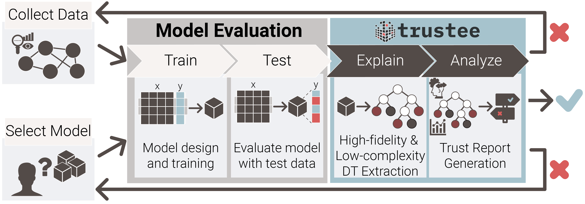

Welcome to Trustee's docs!
===================================

.. warning:: Docs still under construction.

Welcome to Trustee's documentation. Get started with `installation`
and then get an overview with the `quickstart`. The rest of the docs
describe each component of Trustee in detail, with a full reference in 
the :doc:`api` section.

Overview
-------------

Trustee is a framework to extract decision tree explanation from black-box ML models.

  
  Standard AI/ML development pipeline extended by Trustee.
  

Getting Started
---------------
This section contains basic information and instructions to get started with Trustee.

Python Version
***************

Trustee supports Python >=3.8 and <=3.9. In theory, other versions of Python 3.x and newer could be supported as well, 
but support is limited by the versions of Python supported by Trustee's dependecies. We are considering a no-deps core 
release in the future. 

Install Trustee
***************

Use the following command to install Trustee:

.. code-block:: sh

    $ pip install trustee

Sample Code
*******************

.. code:: python

  import pandas as pd

  from sklearn import datasets
  from sklearn.ensemble import RandomForestClassifier
  from sklearn.model_selection import train_test_split
  from sklearn.metrics import classification_report

  from trustee import ClassificationTrustee

  iris = datasets.load_iris()
  X, y = datasets.load_iris(return_X_y=True)
  X_train, X_test, y_train, y_test = train_test_split(X, y, test_size=0.30)

  data = pd.DataFrame(
      {
          "sepallength": iris.data[:, 0],
          "sepalwidth": iris.data[:, 1],
          "petallength": iris.data[:, 2],
          "petalwidth": iris.data[:, 3],
          "species": iris.target,
      }
  )

  clf = RandomForestClassifier(n_estimators=100)
  clf.fit(X_train, y_train)
  y_pred = clf.predict(X_test)

  trustee = ClassificationTrustee(expert=clf)
  trustee.fit(X_train, y_train, num_iter=50, samples_size=0.3, verbose=True)
  dt = trustee.prune(top_k=10)
  dt_y_pred = dt.predict(X_test)

  print("Top-k Model explanation global fidelity report:")
  print(classification_report(y_pred, dt_y_pred))
  print("Top-k Model explanation score report:")
  print(classification_report(y_test, dt_y_pred))

Other Use Cases
*******************
For other examples and use cases of how Trustee can used to scrutinize ML models, listed in the table below, please check our `Use Cases repository <https://github.com/TrusteeML/emperor>`_.

.. table::
    :class: align-left
    
    ===================== ============================================================================================================================================================================
    Use Case              Description
    ===================== ============================================================================================================================================================================
    `heartbleed_case/`    Trustee application to a Random Forest Classifier for an Intrustion Detection System, trained with CIC-IDS-2017 dataset pre-computed features.
    `kitsune_case/`       Trustee application to Kitsune  model for anomaly detection in network traffic, trained with features extracted from Kitsune's Mirai attack trace.
    `iot_case/`           Trustee application to Random Forest Classifier to distguish IoT devices, trained with features extracted from the pcaps from the UNSW IoT Dataset.
    `moon_star_case/`     Trustee application to Neural Network Moon and Stars Shortcut learning toy example.
    `nprint_ids_case/`    Trustee application to the nPrintML AutoGluon Tabular Predictor for an Intrustion Detection System, also trained using pcaps from the CIC-IDS-2017 dataset.
    `nprint_ids_case/`    Trustee application to the nPrintML AutoGluon Tabular Predictor for OS Fingerprinting, also trained using with pcaps from the CIC-IDS-2017 dataset.
    `pensieve_case/`      Trustee application to the Pensieve RL model for adaptive bit-rate prediction, and comparison to related work Metis.
    `vpn_case/`           Trustee application the 1D-CNN trained to detect VPN traffic trained with the ISCX VPN-nonVPN dataset.
    ===================== ============================================================================================================================================================================

Supported AI/ML Libraries
*************************

.. table::
    :class: align-left

    ==============  ===================
    Library         Supported  
    ==============  ===================
    `scikit-learn`  |:white_check_mark:|
    `Keras`         |:white_check_mark:|
    `Tensorflow`    |:white_check_mark:|
    `Pytorch`       |:white_check_mark:|
    `AutoGluon`     |:white_check_mark:|
    ==============  ===================

API Reference
-------------

If you are looking for information on a specific function, class or
method, this part of the documentation is for you.

.. toctree::
  :maxdepth: 2

  api

Citing Us
---------

.. code::

  @inproceedings{Jacobs2022,
    title        = {AI/ML and Network Security: The Emperor has no Clothes},
    author       = {A. S. Jacobs and R. Beltiukov and W. Willinger and R. A. Ferreira and A. Gupta and L. Z. Granville},
    year         = 2022,
    booktitle    = {Proceedings of the 2022 ACM SIGSAC Conference on Computer and Communications Security},
    location     = {Los Angeles, CA, USA},
    publisher    = {Association for Computing Machinery},
    address      = {New York, NY, USA},
    series       = {CCS '22}
  }

